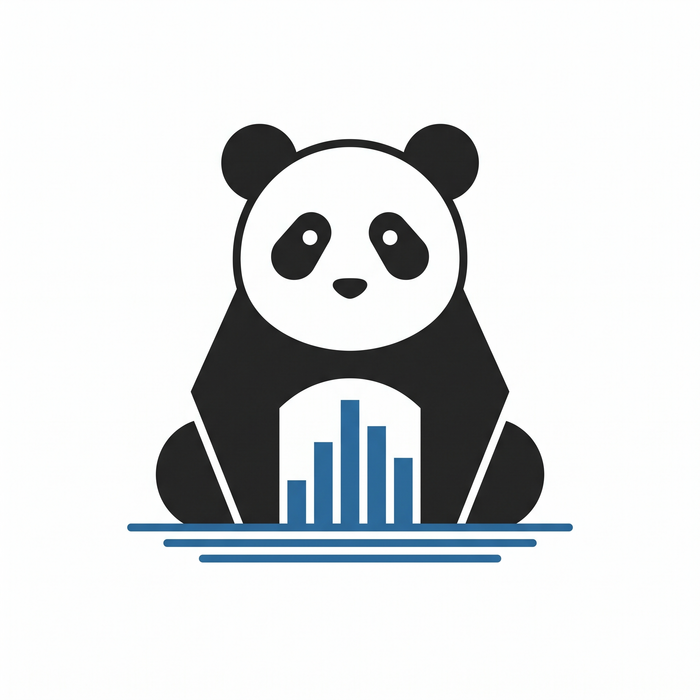

# Introducción

<p align="center">
  
</p>

¡Bienvenido o bienvenida a **Pandas de Cero a Experto**! Este libro es una guía integral,
pensada para llevarte desde tus primeros pasos en Python hasta un dominio avanzado de
[pandas](https://pandas.pydata.org/), la librería de referencia para análisis y manipulación
de datos en el ecosistema de Python.

## ¿Para quién es este libro?

Este libro está diseñado para ser accesible a **principiantes absolutos** en programación
y ciencia de datos, pero sin sacrificar profundidad ni rigor técnico a medida que avanzas.
Si ya tienes experiencia con Python o incluso con pandas, puedes saltar directamente a los
módulos que te interesen — cada módulo está pensado para poder consultarse de forma
relativamente independiente una vez cubiertos sus prerrequisitos.

No necesitas ningún conocimiento previo de programación para empezar por el Módulo 1. Si ya
sabes Python pero eres nuevo en pandas, puedes comenzar directamente en el Módulo 2.

## ¿Por qué aprender Python?

Antes de invertir cientos de horas en esto, vale la pena tener claro el "por qué". Python se
convirtió en el lenguaje de facto de la ciencia de datos, el análisis y el machine learning por
razones concretas, no por moda:

- **Es legible casi como pseudocódigo.** La curva de aprendizaje inicial es más suave que la de
  la mayoría de los lenguajes de propósito general — puedes concentrarte en resolver el
  problema, no en pelear con la sintaxis.
- **Tiene el ecosistema de datos más grande y maduro que existe.** NumPy, pandas, Matplotlib,
  scikit-learn, PyTorch, TensorFlow, statsmodels — prácticamente todo lo que necesitas para
  análisis de datos y machine learning vive en Python, con librerías que se integran bien entre
  sí (todas construidas, directa o indirectamente, sobre NumPy).
- **Es versátil más allá de los datos.** El mismo lenguaje sirve para automatizar tareas,
  construir aplicaciones web (Django, Flask), escribir scripts de sistema, o programar
  microcontroladores — una habilidad que se reutiliza en muchos contextos, no solo en análisis
  de datos.
- **Tiene demanda real en el mercado laboral**, consistentemente entre los lenguajes más
  solicitados en roles de datos, backend, automatización e investigación científica.
- **Su comunidad y documentación son enormes.** Casi cualquier error que encuentres ya lo
  encontró, documentó y resolvió alguien más antes que tú — algo que notarás constantemente al
  usar los recursos de la [página de Recursos Recomendados](recursos.md).

> 💡 No aprendes Python para "saber programar" en abstracto — lo aprendes porque es la
> herramienta que te permite hacerle preguntas a los datos y obtener respuestas. Todo el
> Módulo 1 está diseñado con ese objetivo específico en mente, no como un curso de
> programación general.

## ¿Por qué aprender pandas?

Si Python es el lenguaje, pandas es la herramienta específica que vas a usar en el día a día
para trabajar con datos tabulares — hojas de cálculo, tablas de bases de datos, resultados de
APIs, archivos CSV. Algunas razones concretas por las que este libro dedica 8 de sus 9 módulos
a dominarlo:

- **Es el estándar de la industria.** Prácticamente cualquier flujo de trabajo de datos en
  Python —desde un análisis exploratorio rápido hasta un pipeline de producción— pasa por
  pandas en algún punto.
- **Resuelve el problema real: datos desordenados.** Los datos del mundo real casi nunca llegan
  limpios. pandas fue diseñado específicamente para lidiar con valores faltantes, tipos
  inconsistentes y formatos irregulares — el Módulo 3 completo gira en torno a esto.
- **Es el punto de entrada al resto del ecosistema.** Un `DataFrame` de pandas es lo que le
  entregas a Matplotlib para graficar, a scikit-learn para entrenar un modelo, o a statsmodels
  para un análisis estadístico — aprender pandas bien hace que todo lo demás sea más fácil.
- **La habilidad se transfiere.** Herramientas más recientes para datos a mayor escala (Polars,
  Dask, incluso la API de pandas-on-Spark) imitan deliberadamente la API de pandas — lo que
  aprendas aquí no se queda obsoleto cuando cambies de herramienta.
- **Es directamente aplicable a preguntas de negocio reales**, no solo a ejercicios académicos
  — es precisamente lo que vas a practicar en los 19 proyectos del Módulo 9.

> 💡 Dominar pandas no es memorizar cada método de su API (nadie lo hace) — es desarrollar la
> intuición de **qué operación corresponde a qué pregunta sobre tus datos**. Ese es el
> objetivo real de este libro.

## ¿Cómo está organizado el libro?

El contenido sigue una progresión de dificultad creciente, organizada en **9 módulos**:

1. **Cimientos** — Fundamentos de Python y del ecosistema de datos (NumPy, Jupyter, Matplotlib).
2. **Introducción a Pandas** — Series, DataFrames, lectura/escritura de datos, navegación básica.
3. **Manipulación de Datos** — Limpieza, transformación, reshape y creación de variables.
4. **Análisis Exploratorio de Datos (EDA)** — Estadística descriptiva, agregaciones, visualización.
5. **Operaciones Avanzadas** — Series de tiempo, vectorización, I/O avanzado, MultiIndex.
6. **Análisis Estadístico y Machine Learning** — Estadística inferencial, preparación de datos e integración con scikit-learn.
7. **Optimización y Performance** — Profiling, optimización de código, gestión de memoria, paralelización.
8. **Casos Especiales y Dominios** — Datos geoespaciales, financieros, académicos y pipelines ETL.
9. **Proyectos Integradores** — 19 proyectos progresivos, presentados como historias de
   usuario y backlog, que combinan todo lo aprendido.

Cada módulo se divide en **temas** (capítulos) y cada tema en **subtemas** (secciones), siguiendo
la misma jerarquía de la ruta de aprendizaje que sirvió de base para este libro. Al final del
libro encontrarás además una guía de ritmo de estudio, una lista de recursos recomendados y un
checklist de competencias para autoevaluarte.

## Convenciones usadas en este libro

A lo largo de los capítulos encontrarás los siguientes elementos recurrentes.

**Bloques de código** en Python, listos para copiar y ejecutar:

```python
import pandas as pd

df = pd.DataFrame({"producto": ["A", "B"], "precio": [10, 20]})
print(df)
```

**Salida esperada**, mostrada justo después del código que la produce, para que puedas
verificar que tus resultados coinciden con los míos:

```text
  producto  precio
0        A      10
1        B      20
```

**Advertencias**, marcadas con ⚠️, que señalan errores comunes o comportamientos
contraintuitivos de pandas — presta atención especial a estas, son los sitios donde más gente
se tropieza:

> ⚠️ **Ejemplo de advertencia:** `df["precio"]` devuelve una `Series`, pero `df[["precio"]]`
> (con doble corchete) devuelve un `DataFrame` de una sola columna. Parecen casi lo mismo,
> pero tienen métodos y comportamientos distintos — este tipo de detalle es exactamente lo que
> las advertencias del libro te van a señalar antes de que te encuentres con el error tú
> mismo.

**Tips**, marcados con 💡, con recomendaciones prácticas o atajos que no son estrictamente
necesarios pero sí útiles:

> 💡 **Ejemplo de tip:** cuando dudes entre dos formas de escribir algo en pandas, prefiere la
> más explícita mientras aprendes — la más corta casi siempre llega sola, con la práctica.

**Ejercicios de práctica**, al final de secciones puntuales, para consolidar un concepto
específico apenas aprendido. Se ven así:

> **Ejercicios: Nombre de la sección**
>
> 1. Un ejercicio corto, enfocado en el concepto que acabas de leer.
> 2. Otro un poco más exigente, que te obliga a combinar ese concepto con algo anterior.

**Ejercicios integradores**, al final de cada capítulo, que combinan varios conceptos del
tema en un ejercicio más completo — más parecidos a un mini-problema real que a una práctica
aislada de un solo método.

## Preparando tu entorno

Para seguir los ejemplos de este libro necesitas un entorno de Python funcional. La
recomendación mínima es:

```bash
python -m venv .venv
source .venv/bin/activate   # En Windows: .venv\Scripts\activate

pip install pandas numpy matplotlib jupyter
```

A medida que el libro avance hacia módulos más especializados (machine learning, datos
geoespaciales, optimización), cada capítulo indicará las dependencias adicionales necesarias
(por ejemplo, `scikit-learn`, `geopandas` o `numba`).

> 💡 No es necesario instalar todo desde el principio. Instala las librerías a medida que
> el libro las vaya requiriendo.

## Datasets usados en el libro

Salvo indicación contraria, los ejemplos usan **datos sintéticos generados dentro del propio
código** (con `pandas` y `numpy`), de modo que puedas ejecutar cada bloque sin depender de
archivos externos. Los proyectos del Módulo 9 son la excepción: allí se recomiendan datasets
públicos reales (Kaggle, UCI) para practicar con datos del mundo real.

## Cómo aprovechar mejor este libro

- **Escribe el código, no lo copies y pegues.** Escribir a mano ayuda a fijar la sintaxis y
  a detectar errores comunes por ti mismo.
- **Resuelve los ejercicios antes de ver la solución** (cuando se incluya), o intenta primero
  sin mirar el código de ejemplo.
- **Experimenta.** Cambia los datos de ejemplo, rompe el código a propósito y observa los
  errores — es una de las formas más rápidas de aprender pandas.
- **Consulta la [Guía de Dedicación y Ritmo](guia-ritmo.md)** si quieres planificar tu avance
  en semanas o meses según tu disponibilidad.

¡Empecemos!
